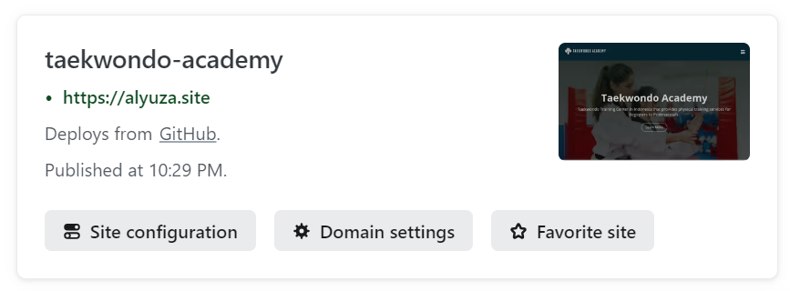
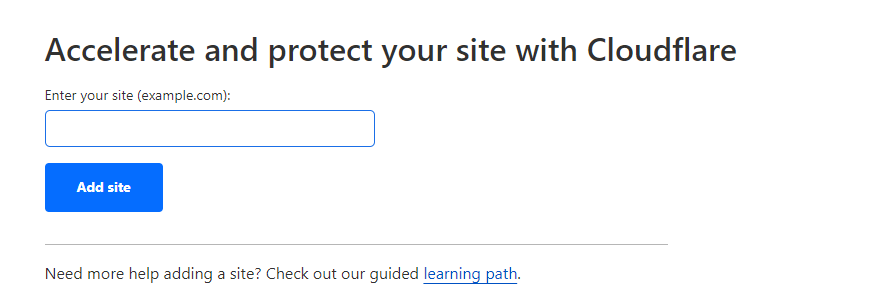

<!-- [](https://classroom.github.com/a/f6dTnkNL) -->
# Project Milestone 1 - Alyuza


## Website Overview
Official website of the largest Taekwondo Community in Indonesia, has several training centers spread throughout Indonesia. This website is designed to be fully responsive and supports multiple dimensions, including desktop and mobile phones.

### Deployment ⚙️
The website is hosted by Netlify on [alyuza.site](https://alyuza.site)

### Features
- Optimized for Desktop browsing
- Responsive layout and Compatible with mobile devices
- We can see Infinite Scroll Image, learn from [YouTube](https://www.youtube.com/watch?v=3Z780EOzIQs)

### Website Test
The website has been tested on the following platforms:

- Google Chrome (Recommended)
- Mobile devices (Android and IOS) 

## Codes
```
//prepare projects
git clone https://github.com/RevoU-FSSE-2/week-5-alyuza.git
cd week-5-alyuza
git add .
code .

//review status / changes
git status

//how to commits
git commit -f 'commit message'
git remote set-url origin https://github.com/RevoU-FSSE-2/week-5-alyuza.git

//push to github
git push origin main
```
## Continous Deployment
Importing existing Github project to Netlify. 
1. Login to netlify, connect git to netlify
2. Add new site
3. Pick a repository from github
4. Site configuration and deploy



## DNS Settings
Domain is provided by Niagahoster and managed through Cloudflare.
1. Login to Cloudflare, and then adding new site


2. Mohon bersabar ini masih diketik :)