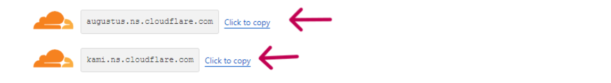

<!-- [](https://classroom.github.com/a/f6dTnkNL) -->
# Taekwondo Academy 🥋
## Project Milestone 1 - Alyuza Satrio Prayogo 👦🏻


## Website Overview 💻
Official website of the largest Taekwondo Community in Indonesia, has several training centers spread throughout Indonesia. This website is designed to be fully responsive and supports multiple dimensions, including desktop and mobile phones.

## STRUCTURE 🧱
- Header
  - Navbar
- Main
  - Home section
  - About section
  - Programs section
  - Instructor section
  - Contact Us section
- Footer

## Deployment ⚙️
The website is hosted by Netlify on [alyuza.site](https://alyuza.site)

## Features 💽
- Optimized for Desktop browsing
- Responsive layout and Compatible with mobile devices
- We can see Infinite Scroll Image, learn from [YouTube](https://www.youtube.com/watch?v=3Z780EOzIQs)

## Website Test 🔨
The website has been tested on the following platforms:

- Google Chrome (Recommended)
- Mobile devices (Android and IOS) 

## Preparations 📄
```
//git clone
git clone https://github.com/RevoU-FSSE-2/week-5-alyuza.git
cd week-5-alyuza
git add .
code .

//review status / changes
git status

//commits
git commit -f 'commit message'
git remote set-url origin https://github.com/RevoU-FSSE-2/week-5-alyuza.git

//push to github
git push origin main
```
## Continous Deployment 📀
Importing existing Github project to Netlify. 
1. Login to netlify, connect git to netlify
2. Add new site
3. Pick a repository from github
4. Site configuration and deploy


## DNS Settings ⌨️
1. Login to Cloudflare, and then adding new site.

<br>

2. Scroll down, choose free.

<br>

3. Add Cloudflare's name servers. Copy 2 server names below.

<br>

4. Login to NiagaHoster and paste name server.

<br>

5. Back to Cloudflare > Click your site (mine : alyuza.site) > DNS > Records > DNS Management. Then Add record >> CNAME : alyuza.site || Content : taekwondo-academy.netlify.app

<br>

6. Back to Netlify choose your project and Add a domain (alyuza.site) / (your site).

<br>

7. Finish.


## Google Lighthouse Score 📈

